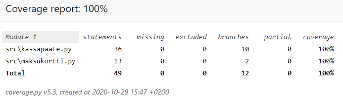
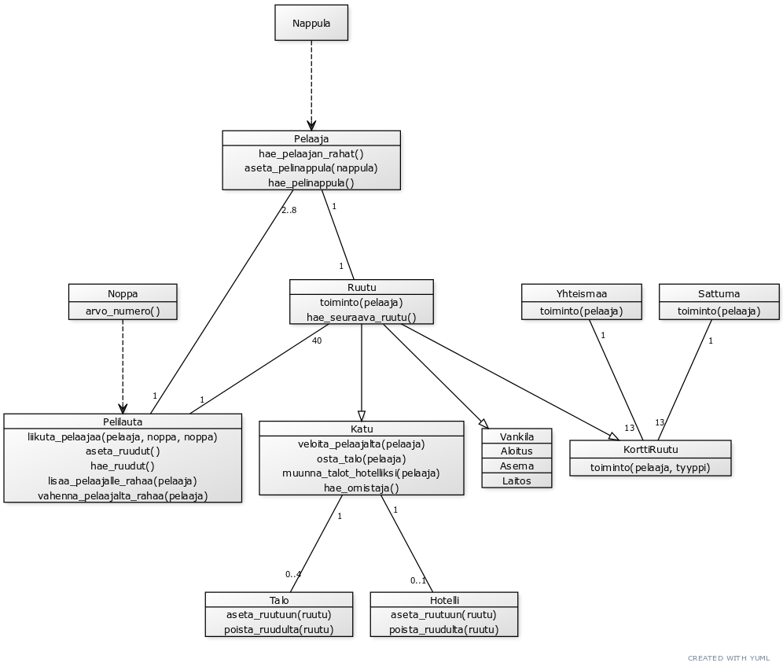
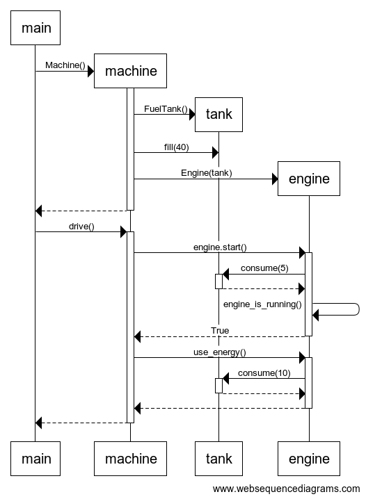
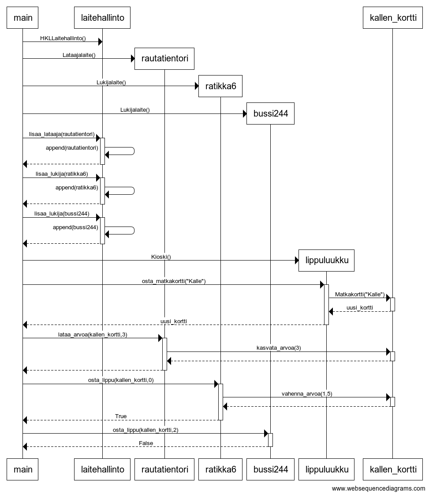

# Ohjelmistotekniikka 2020 Syksy

## Tehtävät:

### Viikko 1

[gitlog.txt](viikko1/gitlog.txt)

[komentorivi.txt](viikko1/komentorivi.txt)

### Viikko 2

### Viikko 3

_Linkki projektiin tulee myöhemmin_
