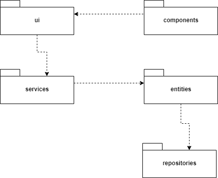
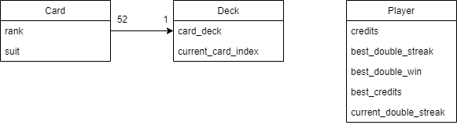
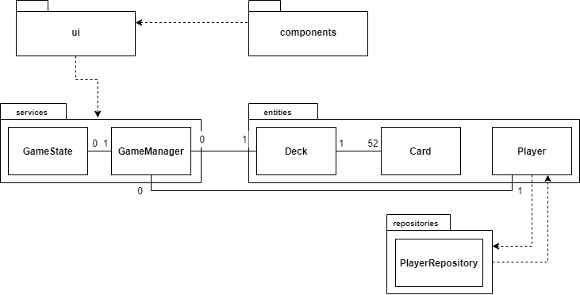
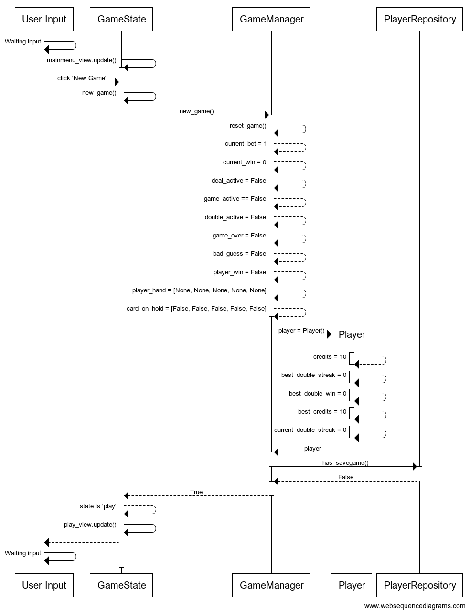
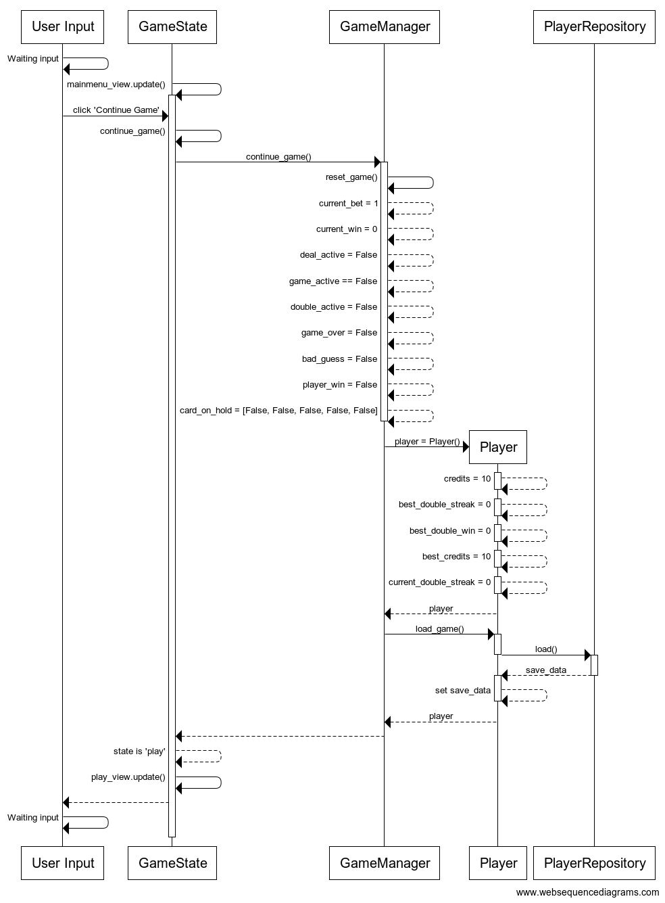
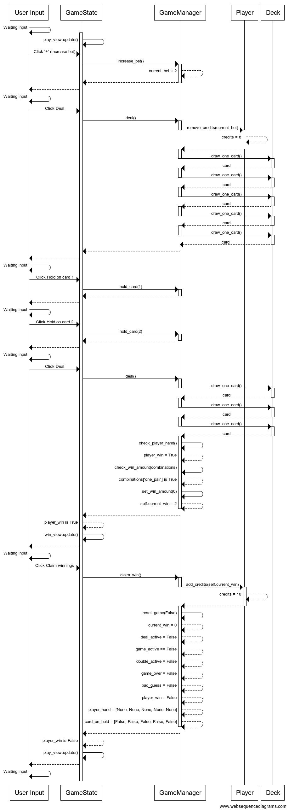
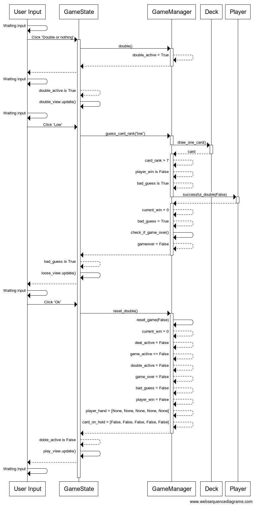

# Arkkitehtuurikuvaus

## Rakenne

Ohjelman rakenne noudattelee kolmitasoista kerrosarkkitehtuuria, ja koodin pakkausrakenne on seuraava:

Pakkaus _ui_ pitää sisällään sovelluksen eri käyttöliittymä-näkymät sekä käyttöliittymissä käytettävät komponentit, _repositories_ sovelluksen tiedon pysyväistallennuksesta vastaavaa koodia, _services_ vastaa sovelluksen logiikasta, kuten sovelluksen tilasta ja näkymien vaihtamisesta, _entities_ kuvaa puolestaan sovelluksen käyttämiä tietoluokkia.

## Käyttöliittymä

Käyttöliittymä sisältää neljä erillistä päänäkymää:

- Päävalikko (_Mainmenu_)
- Tulostaulukko (_Scoreboard_)
- Pelinäkymä (_Playview_)
- Maksutaulukko (_Payouts_)

Jokainen näkymä on toteutettu omaan luokkaansa ja näkyvät yksi kerrallaan käyttäjälle. Näkymien näyttämisestä vastaa [GameState](../src/services/game_state.py)-luokka ja itse sovelluslogiikka on pyritty eristämään omaan [GameManager](../src/services/game_manager.py)-luokkaan.

Kun sovelluksen eri näkymiä kutsutaan, vaihdetaan `GameState`-luokassa tilaksi näkymän nimi, joka päivittää kyseistä näkymää silmukassa.

## Sovelluslogiikka

Sovelluksen loogisen tietomallin muodostavat luokat [Card](../src/services/card.py), [Deck](../src/services/deck.py) ja [Player](../src/services/player.py), jotka kuvaavat kortteja, korttipakkaa sekä pelaajaa:

Näitä luokkia hallinnoi [GameManager](../src/services/game_manager.py)-luokka. _GameManager_ sisältää metodeja, jotka ohjailevat sovelluksen toimintaa hyödyntäen tietomallin luokkia, näitä ovat esimerkiksi.

- `deal()`
- `claim_win()`
- `double()`

_GameManager_ pääsee käsiksi myös pakkauksessa _repository_ sijaitsevaan luokkaan [PlayerRepository](../src/repositories/player_repository.py) joka hallinnoi käyttäjän tiedon tallentamista ja lataamista. Tallennettavan käyttäjä injektoidaan tallennusmetodin kutsun yhteydessä. Vastaavasti ladattaessa tietoa, käyttäjän tieto palautetaan kutsun yhteydessä.

`GameManager` ja `GameState`-luokkien, ja ohjelman muiden osien suhdetta kuvaava luokka/pakkauskaavio:

## Tietojen pysyväistallennus

### Tiedostot

## Päätoiminnallisuudet

Seuraaavaksi kuvataan sovelluksen toimintalogiikkaa muutaman päätoiminnallisuuden osalta sekvenssikaaviona. Kaavioissa käyttäjän syötettä kuvaa `User Input`.

### Uuden pelin aloittaminen

Kun päävalikon `New game`-painiketta painetaan, etenee sovelluksen kontrolli seuraavasti:

Painikkeen [tapahtumakäsittelijä](../src/ui/components/button.py#L79) kutsuu sovelluslogiikan `GameState` metodia [new_game](../src/services/game_state.py#L126) joka puolestaan kutsuu pelilogiikkaa hallitsevan `GameManager`:in metodia [new_game](../src/services/game_manager.py#L35). Seuraavaksi pelitilannetta hallitsevat muuttujat alustetaan [reset_game](../src/services/game_manager.py#L24) metodilla, ja luodaan uusi `Player`-olio. Tämän jälkeen `GameState` asettaa tilaksi `play` ja rupeaa päivittämään pelinäkymää käyttäjälle.

### Vanhan pelin jatkaminen

Kun käyttäjä haluaa jatkaa vanhaa peliään `Continue`-painikkeella, etenee sovelluksen kontrolli seuraavasti.

Painikkeen [tapahtumakäsittelijä](../src/ui/components/button.py#L79) kutsuu sovelluslogiikan `GameState` metodia [continue_game](../src/services/game_state.py#L110) joka puolestaan kutsuu pelilogiikkaa hallitsevan `GameManager`:in metodia [new_game](../src/services/game_manager.py#L35). Seuraavaksi pelitilannetta hallitsevat muuttujat alustetaan [reset_game](../src/services/game_manager.py#L24) metodilla, ja luodaan uusi `Player`-olio. Tämän jälkeen kutsutaan `Player` luokan [load_player](../src/entities/player.py#L33) metodia, joka hakee `PlayerRepository`:n kautta tallennetut tiedot. Jos tallenne on tyhjä, ei peliä voida jatkaa. Tässä tapauksessa tallenne ei ollut tyhjä, ja pelaajan muuttujat haetaan tiedostosta. Tämän jälkeen `GameState` asettaa tilaksi `play` ja rupeaa päivittämään pelinäkymää käyttäjälle.

### Yhden vuoron pelaaminen

Tarkastellaan tilannetta, missä käyttäjä korottaa korottaa panosta kerran, aktivoi pelaamisvuoron, sekä vuoron aikana vaihtaa kaksi pelikorttia. Sovelluksen kontrolli etenee seuraavanlaisesti:

Painikkeen `+` [tapahtumakäsittelijä](../src/ui/components/button.py#L79) kutsuu `GameManager`:in metodia [increase_bet](../src/services/game_manager.py#L32), ja korottaa käytettävää panosta yhdellä. Tämä näkyy käyttäjälle realiaikaisesti, koska jatkuvasti päivitetään pelinäkymää pääsilmukassa.

Tämän jälkeen `Deal`-painikkeen painamisen jälkeen, [tapahtumakäsittelijä](../src/ui/components/button.py#L80) kutsuu `GameManager`:in metodia [deal](../src/services/game_manager.py#L90), jonka logiikka aloittaa pelivuoron. Pelivuoron alussa kutsutaan `Player`:n metodia [remove_credits](../src/entities/player.py#L22), parametrilla `current_bet`. Seuraavaksi kutsutaan `Deck`:n metodia [draw_one_card](../src/entities/deck.py#L20) viisi kertaa jonka jälkeen pelikortit näkyvät pelinäkymässä.

Nyt kun käyttäjä lukitsee pelikortteja, painikkeen [tapahtumakäsittelijä](../src/ui/components/button.py#L79) kutsuu `GameManager`:in metodia [hold_card](../src/services/game_manager.py#L50) ja saa parametrina lukittavan kortin numeron. Kun käyttäjä on tyytyväinen lukittuihin kortteihin, painikkeella `Deal` aktivoidaan taas `GameState`-luokan kautta `GameManager´:n metodi [deal](../src/services/game_manager.py#L90), joka vaihtaa uudet pelikortit _ei-lukittujen_ pelikorttien paikalle, ja tarkistaa onko käyttäjällä voittoa.

Voiton tarkistus tapahtuu `GameManager`:in metodilla [check_player_hand](../src/services/game_manager.py#L112) joka vastaa pelin voittologiikasta. Koska kyseessä oli voittava käsi, kutsutaan `GameManager`:in metodia [set_win_amount](../src/services/game_manager.py#L190) sekä asetetaan muuttuja `player_win` todeksi.

Tämän jälkeen `GameState` huomaa, että käyttäjä on voittanut, ja näyttää käyttäjälle voittonäkymän.

Kun käyttäjä painaa `Claim` painiketta, [tapahtumakäsittelijä](../src/ui/components/button.py#L79) kutsuu `GameManager`:in metodia [claim_win](../src/services/game_manager.py#L209), joka puolestaan kutsuu `Player`:in metodia [add_credits](../src/entities/player.py#L16) parametrinaan kyseisen voittokäden voittosumman. Tämän jälkeen `GameManager` asettaa muuttujat `current_win` nollaksi, sekä `player_win` epätodeksi, ja `GameState` huomaa muutokset pääsilmukassa, ja palaa näyttämään pelinäkymää käyttäjälle.

### Voiton tuplaaminen

Voittotilanteessa, käyttäjällä on mahdollisuus voiton tuplaamiseen painamalla painiketta `Double or nothing`, ja arvaamalla oikein kortin arvo. Tarkastellaan tilannetta, missä käyttäjä arvaa kortin arvon olevan matala (_Low_).

Painikkeen `Double or nothing` [tapahtumakäsittelijä](../src/ui/components/button.py#L79) kutsuu `GameManager`:in metodia [double](../src/services/game_manager.py#L56), joka valmistelee sovelluksen tuplaamista varten valmiiksi, sekä asettaa muuttujan `double_active` todeksi. Tämän jälkeen `GameState` huomaa, että muuttuja `double_active` on tosi ja siirtää näkymän tuplausnäkymään.

Käyttäjä painaa painiketta `Low` jonka [tapahtumakäsittelijä](../src/ui/components/button.py#L80) kutsuu `GameManager`:in metodia [guess_card_rank](../src/services/game_manager.py#L61) parametrilla `'low'`, joka puolestaan kutsuu `Deck`:in metodia [draw_one_card](../src/entities/deck.py#L20). Metodin [guess_card_rank](../src/services/game_manager.py#L61) logiikka tarkistaa arvauksen tämän jälkeen, ja asettaa pelin häviämistilaan, sekä kutsuu `Player`:in metodia [successful_double](../src/entities/player.py#L27) parametrilla `False`. Tämä metodi liittyy `Player` statistiikkaan.

`GameState` huomaa, että arvaus oli huono joten käyttäjälle näytetään häviönäkymä. Käyttäjä vahvistaa tämän painamalla painiketta `OK` ja painikkeen [tapahtumakäsittelijä](../src/ui/components/button.py#L79) kutsuu `GameManager`:in metodia [end_double](../src/services/game_manager.py#L86), joka päättää tuplauspelin. Nyt `GameState` tämän huomattuaan, siirtyy näyttämään pelinäkymää käyttäjälle.

### Muut toiminnallisuudet

Samanlainen toiminta toistuu sovelluksen muissa toiminnallisuuksissa, tapahtumankäsittelijän kautta kutsutaan sovelluslogiikan metodeita, ja päivittävät mitä ruudulla näytetään käyttäjälle, tai muuttavat sovelluksen tilaa. Pääsilmukkaan palattaessa päivitetään valintojen perusteella näykmää.
