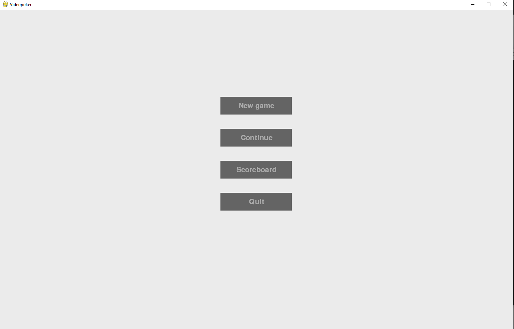
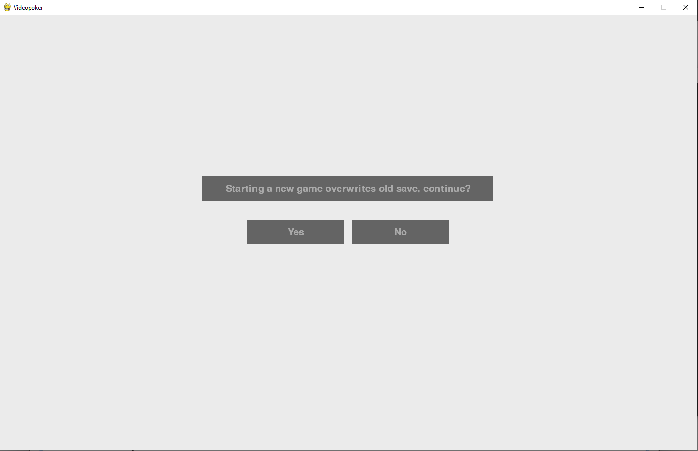
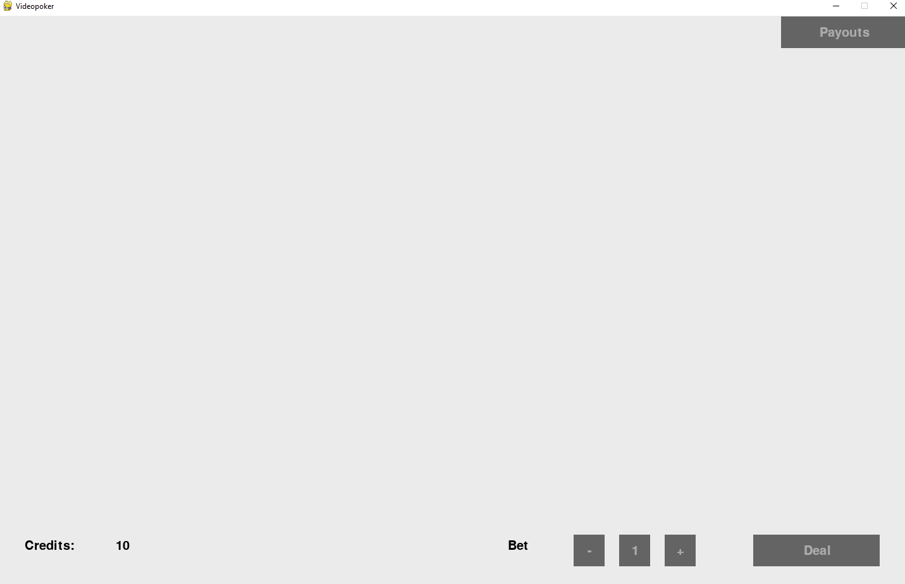
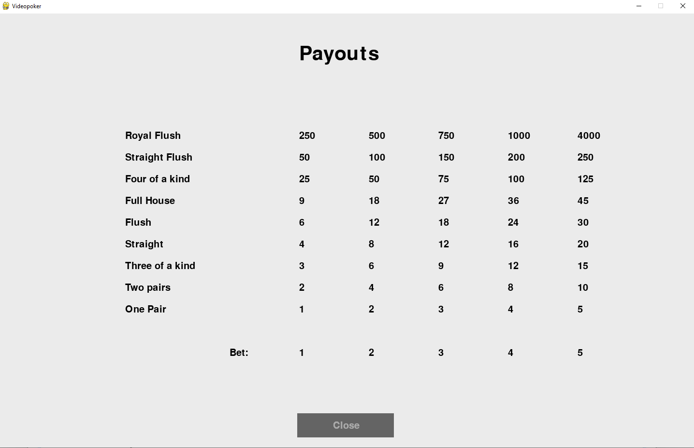
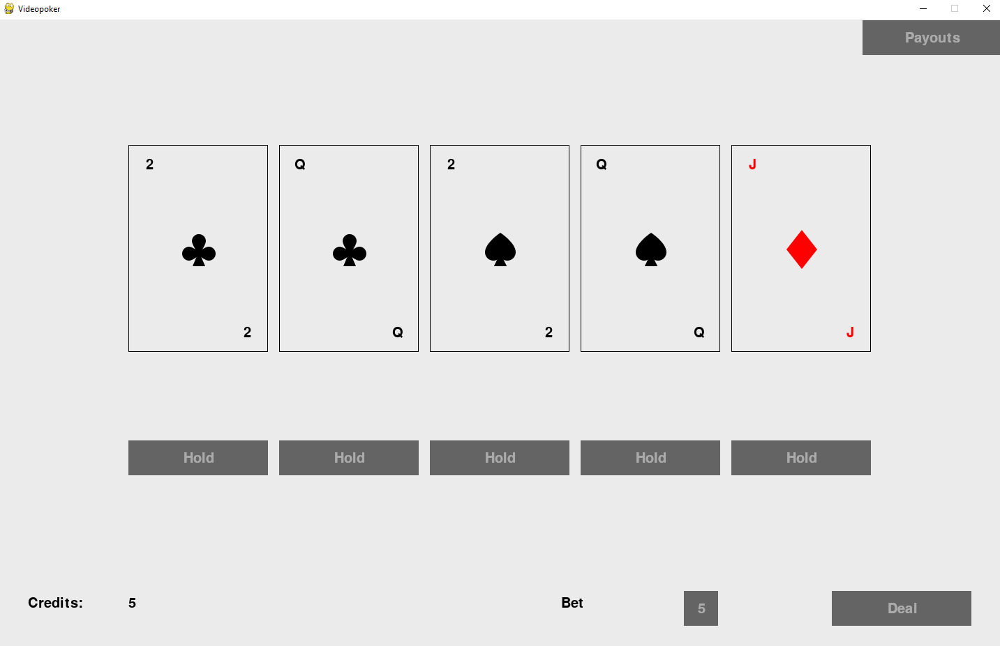
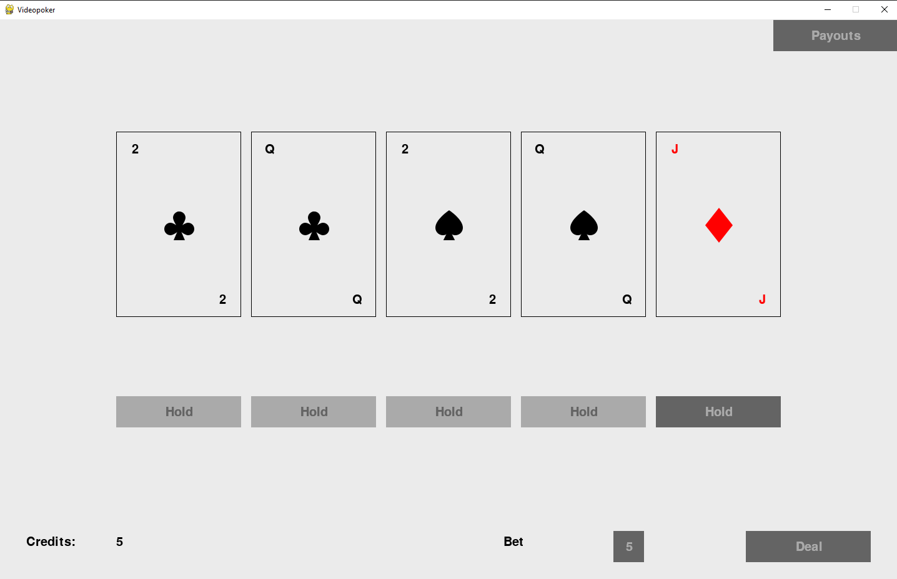
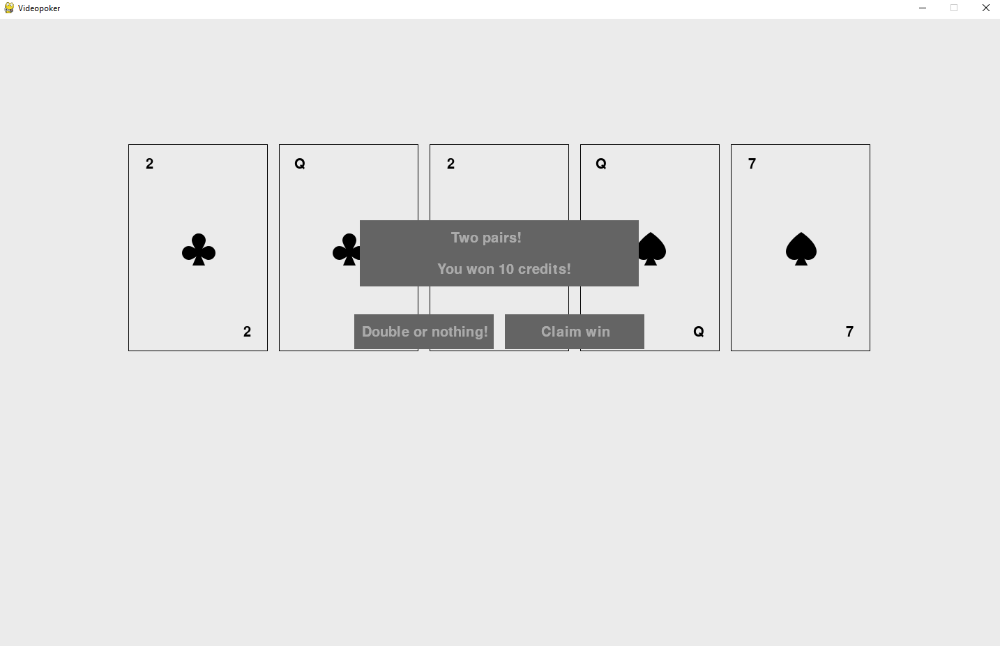
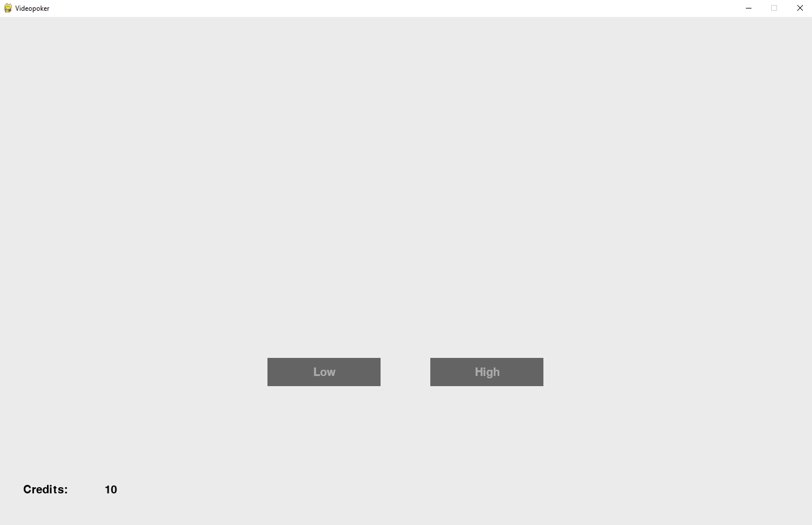

# Käyttöohje

Lataa projektin viimeisimmän [releases](https://github.com/k0psutin/ohte-2020/releases) lähdekoodi valitsemalla _Assets_-osion alta _Source code_.

Sovellus luo automaattisesti tallennustiedostot. Tulostaulukon alustaminen tapahtuu siis poistamalla `highscores.dat` -tiedosto.

## Ohjelman käynnistäminen

Huom. Riippuen käyttöjärjestelmästä, komennot suoritetaan joko `python` tai `python3`.

Ennen ohjelman käynnistämistä, asenna riippuvuudet komennolla:

`python -m pipenv install`

Nyt ohjelman voi käynnistää komennolla:

`python -m pipenv run start`

### Uuden pelin aloittaminen

Sovellus käynnistyy päävalikkoon:

`New game`-painikkeesta aloitetaan uusi peli. Ohjelma varoittaa käyttäjää jos löytyy aktiivinen pelitallennus. Muuten peli siirtyy suoraan `pelinäkymään`.

`No`-painikkeella palataan takaisin alkuvalikkoon, ja tällöin vanhaa tallennusta voidaan jatkaa `Continue`-painikkeella.

Jos siitä huolimatta haluaa aloittaa uuden pelin, tällöin jatketaan tapahtumaa `Yes`-painikkeella.

Peli tallentaa pelitilanteen automaattisesti kun poistut pelinäkymästä päävalikkoon.

### Pelinäkymä

Vasemmasta alareunasta näet jatkuvasti krediittien tilanteen. Kun krediitit laskevat nollaan, on peli hävitty.

Ennen pelivuoroa asetetaan pelissä käytettävä panos, `+/-`-painikkeista. Kun pelivuoro on käynnissä, panosta ei voida muuttaa.

Panos vaikuttaa voittojen suuruuteen. Mitä suurempi panos, sitä enemmän voit voittaa. `Payouts`-painikkeella avataan maksutaulukko, mistä voi nähdä että kuinka paljon milläkin panoksella on mahdollista voittaa.

Kun panos on asetettu, pelivuoro aloitetaan `Deal`-painikkeella.

### Yhden vuoron pelaaminen

Pelivuoron alettua, pelipöydälle jaetaan viisi korttia, mistä valitaan mieleiset. Valitseminen tapahtuu kunkin kortin alapuolella olevalla `Hold`-painikkeella, joka lukitsee kortin - eli sitä ei vaihdeta korttienvaihdon yhteydessä.

Kun mielekkäät kortit on valittuna, vaihdetaan ei-lukitut kortit uusiin jatkamalla pelivuoroa `Deal`-painikkeesta.

Kun uudet kortit on jaettu, ja pelaajalla on voittava käsi, ilmoitetaan siitä voittoilmoituksella. Voittorahat voidaan ottaa talteen, tai kokeilla kaksinkertaistaa `voiton tuplaamisella`.

### Voiton tuplaaminen

Voittosumma on mahdollista kaksinkertaistaa arvaamalla onko seuraavan kortin arvo 7 tai alle `low` vai yli 7 `high`.

Tämä tapahtuu painikkeista `Low` ja `High`.

Tuplaamista voi jatkaa niin kauan, kuin oma kantti kestää. Väärin arvattaessa menetetään kaikki jo tähänasti kerätyt krediitit.
