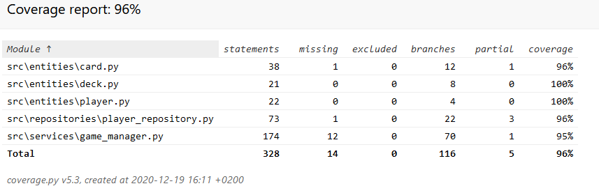

# Testausdokumentti

Ohjelmaa on testattu automatisoiduilla yksikkö- ja intergaatiotesteillä, sekä manuaalisesti tapahtunein järjestelmätason testein.

## Yksikkötestaaminen

### Sovelluslogiikka

Sovelluslogiikasta vastaavaa `GameManager`-luokkaa testataan [TestGameManager](..\src\tests\services\test_game_manager.py)-testiluokalla. `GameManager`-olio luodaan joka testin alussa, ja aloitetaan uusi peli. Osassa testejä hyödynnetään `Card`-olioita luomaan kiinteä pelitilanne, että testaus olisi mahdollisimman kattava.

### Entities-luokat

`Player`-luokkaa testataan [TestPlayer](..\src\tests\entities\player_test.py)-testiluokalla, `Card`-luokkaa testataan [TestCard](..\src\tests\entities\card_test.py)-testiluokalla ja `Deck` -luokkaa [TestDeck](..\src\tests\entities\deck_test.py)-testiluokalla.

### Repositorio-luokat

`PlayerRepository`-luokkaa testataan [TestPlayerRepository](..\src\tests\repository\test_player_repository.py)-testiluokalla. Testiluokka käyttää hyödyksi `PlayerRepository`:n konstruktoria, minkä avulla voidaan luoda valetallenne, mitä käytetään testeissä.

### Testauskattavuus

Käyttöliittymäkerrosta lukuunottamatta sovelluksen testauksen haaraumakattavuus on 94%.

Testaamatta jäivät `game_manager.py`-metodit, jotka hyödyntävät `PlayerRepository`-luokkaa. Syy tähän on se, että nämä osat on jo testattu riittävästi [TestPlayerRepository](..\src\tests\repository\test_player_repository.py)-testiluokalla.

## Järjestelmätestaus

Sovelluksen järjestelmätestaus suoritettiin manuaalisesti kokeilemalla sovelluksen eri osa-alueita.

### Asennus

Sovellusta on kokeiltu Windows 10- sekä Cubbli-ympäristöissä käyttöohjeen mukaisesti.

### Toiminnallisuudet

Kaikki [vaatimusmäärittelydokumentin](vaatimusmaarittely.md) ja käyttöohjeen listaamat toiminallisuudet on käyty läpi.
