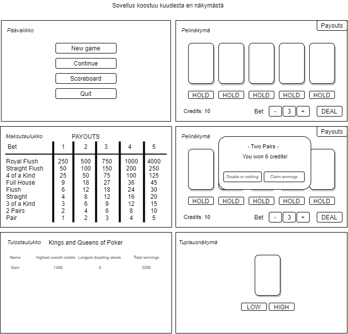

# Vaatimusmäärittely

## Sovelluksen tarkoitus

Sovelluksen tarkoituksena on luoda viihdyttävä yksinpeli jonka pariin jaksaisi tulla yhä uudestaan ja uudestaan.

## Käyttäjät

Käyttäjiä on vain yksi, eli perustoiminnot omaava pelaaja.

## Käyttöliittymäluonnos

## Perustoiminnot

- Alkuvalikko

  - Pelaaja voi luoda uuden pelin (tehty)
  - Pelaaja voi jatkaa vanhaa peliä
  - Pelaaja voi nähdä tulostaulukon
  - Pelaaja voi sulkea sovelluksen (tehty)

- Uusi peli / vanhan jatkaminen

  - Avaa pelinäkymän (tehty)
  - Jos uusi peli, pelaaja aloittaa 10 krediitillä. (tehty)
  - Jos jatketaan vanhaa, haetaan tallennetut krediitit.

- Pelinäkymä

  - Pelaaja voi valita panoksen ennen jakoa +/- painikkeilla. (tehty)
  - Pelaaja ei voi vaihtaa panosta kesken jaon. (tehty)
  - Pelaaja voi lukita yhden tai useamman kortin minkä haluaa säilyttää pelipöydällä. (tehty)
  - Jaon aikana, jakamisnapista saadaan vaihtokortit, mikäli kortteja ei ole lukittu. (tehty)
  - Korttien tietyt kombinaatiot antavat voittoja (tehty)
  - Pelaaja voi klikata voittotaulukon auki voittotaulukko-painikkeesta.
  - Pelaaja voi lisätä tai vähentää pelattavaa panosta ennen jakamista. (tehty)
  - Pelaaja voi yrittää tuplata halutessaan voittamansa summan (tehty)
    - Tuplaamisessa on mahdollisuus kaksinkertaistaa voittosumman. Mikäli pelaaja arvaa oikein, onko käännetty kortti arvoltaan 1-7 (LOW) vai 8-13 (HIGH). Väärin arvattaessa pelaaja menettää koko summan.
    - Tuplaamista voidaan jatkaa niin kauan kuin halutaan.

- Tulostaulukko
  - Pitää sisällään tilastoja mm. paljonko on ollut enimmillään rahaa, pisin tuplausputki ja kaikkien voittojen summan.

## Jatkokehitysideoita

Perustoimintojen jälkeen voidaan lisätä muitakin korttipelejä kuten mm. ventti (_eng. Blackjack_).
